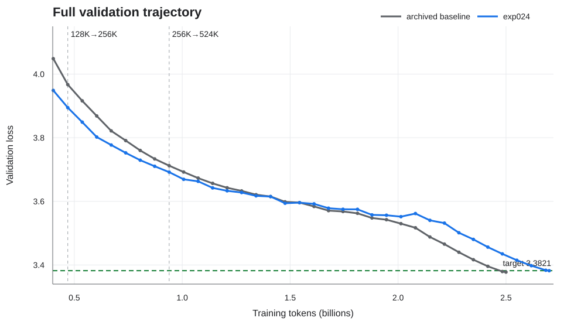
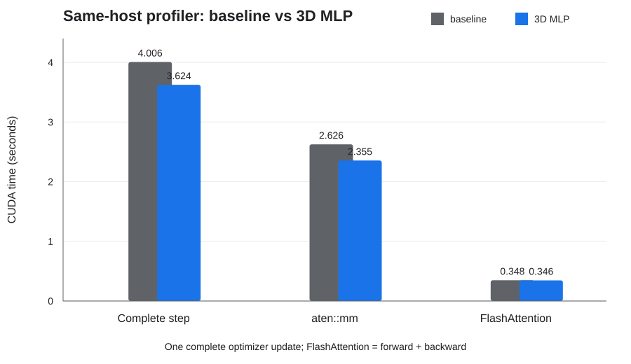

# NoCap challenge – Maksim Obukhov

## TL;DR

I started from the BottleCap NoCap baseline and tried to improve its
compile-inclusive time to the `3.3821` validation-loss target on one RTX 4090.
The baseline profiler showed that matrix multiplications dominated the step, so
I reduced every MLP from `4D` to `3D`. That made a controlled optimizer step
10.54% faster, but the smaller model learned less efficiently, so I had to increase
token budget to `~2.7B`. Smaller early effective batches recovered the loss-per-token deficit at proxy scale, although their advantage disappeared during a full run.

The final treatment, exp024 (see EXPERIMENTS.md table), combined the `3D` MLP with an absolute-token batch
staircase of `64K -> 128K -> 256K -> 524K`. It returned to the baseline batch
before the earlier run's loss advantage vanished. Exp024 reached a final
validation loss of `3.382004976` after 2.700B tokens. Its measured training time
was `19,330.65 s` (5.370 h), nominally 0.58% below the published 5.401 h
baseline. Although, my complete baseline run on rented GPU wall time, including compilation, validation, logging, and checkpoints, was `19,787.84 s` (5.497 h).

This is a borderline single-seed result, not a strong speedup claim. The target
margin was only `0.000095`, smaller than the measured proxy seed variation, and
the published baseline was not rerun on the same rented host. The more useful
result is the experimental path: a systems improvement created a quality
regression, an optimization change compensated for it temporarily, and the
full trajectory showed when that compensation stopped working.

Under the hood the work ran along four tracks:

1. A **systems** track, driven by
the profiler, produced the `3D` MLP win (exp007) and the ablations that show why
it is not free (exp008, exp013-015).
2. An **optimization** track on batch size and
learning rate built the case that small early batches help (exp001, exp002,
exp012), watched that proxy win die over a full run (exp021), and fixed it with
the absolute-token staircase (exp024).
3. An **optimizer** track (exp010 -> exp011
-> exp016) chased a real spectral phenomenon in the AdamW updates that no safe
intervention could exploit.
4. And a **data** track (exp004) tested, and rejected,
a FineWeb-Edu curriculum. The submission is the endpoint of the optimization
track, standing on the systems win and the exp021 failure.



## 1. Problem and baseline

The task was to train a GPT-2-sized autoregressive model on FineWeb and reach a
validation loss of at most `3.3821` on a single GPU. The supplied baseline used
2.5B training tokens and reported a 5.401 h record on an RTX 4090.

I froze a reproducible reference before changing the model. It was a 12-layer,
768-dimensional decoder with 12 attention heads, RMSNorm, RoPE, PyTorch causal
SDPA, `4D` GELU MLPs, and a tied 50,257-token embedding/output matrix. Training
used BF16, AdamW (betas `(0.9, 0.95)`, weight decay `0.1`), sequence length
1,024, and an effective batch of 524,288 tokens. The learning rate followed a
trapezoidal warmup-stable-decay (WSD) schedule: a short linear warmup, a long
plateau at peak LR `0.0018`, and a linear warmdown to zero, with the warmup and
warmdown spans indexed by tokens rather than steps. My archived seed-0 baseline
finished at `3.377696`; the three proxy seeds had mean loss `3.59935` and
sample standard deviation `0.0018`.

I tracked two different clocks:

- `training_time` includes the timed training steps and their first lazy
  compilation;
- `wall_time` starts before the first validation and includes validation,
  compilation, data transitions, logging, and checkpoint work.

I used wall time as the primary internal metric. I report the challenge-style
training timer as well because the published leaderboard uses a narrower timing
boundary.

## 2. Research method

I did not treat the project as a list of methods to try. Each experiment needed
a causal claim: which measured work or learning inefficiency it would change,
why that should improve time-to-target, and what cheap observation could kill
the idea before a full run.

The normal funnel was:

```text
offline accounting or profiler gate   (no training; seconds to minutes)
    -> smoke / health gate            (a few hundred updates; ~40 min)
    -> proxy seed 0                   (937,426,944 tokens, 1,788 updates; ~2 h)
    -> proxy seeds 1 and 2            (same budget, two more seeds)
    -> full seed 0                    (2.5-2.7B tokens; ~5.5 h)
```
I deliberately favoured clean, single-change ablations over stacking several
promising ideas at once. Stacking makes a good final number more likely, but it
also makes attribution impossible: when a combined run wins or loses, you cannot
say which change did the work. Isolating one change at a time produced more
neutral and negative results, but each result was interpretable.

Before paid runs I fixed the token budget, seed, data order, validation policy,
optimizer and schedule unless one of them was the treatment. Git SHA and local
artifacts were the provenance authority. I recorded negative results and stopped
later stages when a preregistered gate failed — for example, a cosine
learning-rate schedule (exp020) and grouped-query attention (exp008) were both
killed at their proxy quality gates, and a shorter-context schedule (exp005) was
dropped at its systems gate before any training run.

The challenge rules explicitly discourage copying Modded-NanoGPT's known
speedups, so at the outset I noted the most popular ones I already knew — the
Muon optimizer, its specific learning-rate tricks, and various stability
patches — specifically so I could steer around them and work from my own
measurements.

Beyond that, candidate ideas came from recent papers, public
implementations, and the questions raised by previous runs; I used literature
and brainstorming to form priors, not as a checklist. For example, a staged
sequence-length curriculum (exp005) — training the first half of the run at
sequence length `T=512` before switching to the full `T=1024` — was not promoted
just because context-length curricula are plausible: an exact-shape systems gate
found a 2.59% steady-state improvement but projected a 1.21% compile-inclusive
regression over the proxy, so I stopped before training it as a systems
experiment.

## 3. Final result and limitations

| Metric | Bottlecap's baseline | My measured baseline | exp024 |
|---|---:|---:|---:|
| GPU class | RTX 4090 | RTX 4090 | RTX 4090 |
| Parameters | about 124M | 124M-scale | 109,376,256 |
| Training tokens | 2.5B | 2,499,805,184 | 2,700,083,200 |
| Final validation loss | ~3.3821  | 3.377696 | **3.382005** |
| Training timer | 5.401 h = ~19443.6 s| 19,725.15 s | **19,330.65 s** |
| Complete wall time | not reported | 20,128.52 s | **19,787.84 s** |
| Aggregate throughput | not reported (aprx. ~128,588 tok/s) | 126,732 tok/s | 139,679 tok/s |
| Peak allocated memory | 9,829 MiB | 9,825 MiB | 9,027 MiB |

exp024, the submitted run, keeps the frozen baseline described in Section 1 and
changes just two things: every MLP is narrowed from `4D` to `3D`, and the
effective batch follows an absolute-token staircase (`64K -> 128K -> 256K ->
524K`) instead of a flat 524K. It spends about 200M extra tokens to buy a faster
step, and finishes just under the target. Because the two baselines were timed on
different rented hosts, I read the timing columns as descriptive context, not as
a controlled hardware speedup.

The result also has a statistical limitation. Exp024 passed the target by
`0.000095`, whereas proxy seed-to-seed variation was about `0.0018`. There is no
multi-seed evidence that the final loss would reliably remain below the target.
The run demonstrates a viable trajectory and a reproducible implementation,
not a precise estimate of expected improvement.

## 4. Profiling and the architecture trade-off

The first steady-state profiler measured a complete optimizer update at about
4.03 s. CUDA idle time was only 29 ms, so data loading and the CPU were not the
main bottlenecks. Grouping the profiled kernels by the function they serve gives
this breakdown of one optimizer step:

| Step component | Self CUDA time | Share of step |
|---|---:|---:|
| `aten::mm` — all matrix multiplies | 2.685 s | 67.1% |
| &nbsp;&nbsp;of which: MLP up/down projections (+ GELU) | — | ~28.5% |
| &nbsp;&nbsp;of which: tied vocabulary projection (`lm_head`) | — | ~23.5% |
| &nbsp;&nbsp;of which: QKV projections | — | ~11.0% |
| FlashAttention forward + backward | 0.355 s | 8.9% |
| CUDA idle | 0.029 s | 0.7% |

The workload is firmly GEMM-bound: two thirds of the step is `aten::mm`, and the
three largest matrix multiplies are the MLP projections, the tied vocabulary
projection, and the QKV projections. FlashAttention is a comparatively small
share.

That profile made MLP width the clearest architectural lever. In exp007 I
changed only the expansion ratio from `4D` to `3D`. A same-host benchmark
reduced the median optimizer step from 3,984.11 ms to 3,604.36 ms, a 10.54%
systems improvement. Profiler `aten::mm` time fell from 2.626 s to 2.355 s while
attention time remained essentially unchanged.



The quality result went in the opposite direction. At the exact proxy token
budget of 937M tokens, exp007 finished at `3.616361`, `+0.018588` worse than
baseline seed 0. The faster step was real, but it did not establish better
time-to-target: the
smaller model needed to recover enough learning efficiency to repay its lost
capacity.
Several nearby architecture changes reinforced that distinction:

* ReLU^2 (exp013) was almost an exact null (`-0.000096` loss, `+0.34%`
  throughput), because the GELU path was already fused and the workload remained
  GEMM-bound;
* GQA (exp008) lost `0.019794` at matched proxy tokens and failed its quality
  gate;
* a `2D` SwiGLU variant (exp015) did not produce a clean proxy result and was
  `1.225%` slower than the uniform-`3D` control in its valid systems comparison.

In each case the technique's reputation elsewhere told me nothing reliable about
this baseline: only measuring the complete path — step time and loss per token
together, on this exact single-GPU setup — settled whether it actually helped.

## 5. Batch size: a proxy win, a full-run failure, and a staircase fix

Exp002 measured that the baseline's 524,288-token effective batch was roughly
5× above the critical batch size (McCandlish et al.'s `B_simple`, estimated from
the ratio of gradient noise to signal) through most of the proxy window. That
means the model was taking larger steps than necessary per token, paying the
fixed per-update overhead without getting proportionally more out of each step.
Smaller early batches make more optimizer updates per token, at the cost of
that same overhead.

Exp001 used a `131K -> 524K` linear batch ramp and improved proxy loss by
`0.036982`, although the gap narrowed late in the run.

Exp012 combined that exact linear ramp (exp001) with the faster `3D` MLP
(exp007, the narrowing from Section 4). This was deliberately a factored
combination: exp001 provided the optimization effect and exp007 the systems
effect. The combined proxy finished at `3.581923`, `0.015850` better
than baseline seed 0, while retaining a 10.18% same-host benchmark improvement.

That proxy result was not enough. Exp021 kept exp012's `3D` MLP unchanged and
changed only the schedule, pushing it harder: a token-linear batch ramp that
started from just 16K and climbed to 256K over the first half of training
(against exp012's 131K -> 524K). It looked excellent early, but its advantage
began to contract before the proxy ended. In the full run the loss gap was `-0.0312`
at 671M tokens, `-0.0134` at 940M, and approximately zero by 1.074B. Exp021
finally reached `3.387356` after 2.700B tokens and missed the target by
`0.005256`.

The failed full run changed the next hypothesis. The problem was no longer
whether small batches helped early (they did) but whether the schedule returned
to the large batch before the extra-update advantage was exhausted. I replaced
the horizon-scaled ramp with absolute token boundaries:

| Token interval | Effective batch | Accumulation | Updates |
|---|---:|---:|---:|
| 0 – 201,326,592 | 65,536 | 4 | 3,072 |
| 201,326,592 – 469,762,048 | 131,072 | 8 | 2,048 |
| 469,762,048 – 939,524,096 | 262,144 | 16 | 1,792 |
| 939,524,096 – 2,700,083,200 | 524,288 | 32 | 3,358 |

At each stage I scaled learning rate by

```text
sqrt(effective_batch_tokens / 524288)
```

relative to the unchanged 524K-reference WSD schedule. The decisive transition
to 524K occurred just below 940M tokens, while exp021 still had a measured loss
buffer. Exp024 then improved final loss over exp021 by `0.005351` and reached
the target, although only narrowly.

## 6. A data-quality curriculum that backfired

I also tested a data intervention rather than an architecture or optimizer
change. FineWeb-Edu ships a small classifier
(`HuggingFaceFW/fineweb-edu-classifier`) that rates each document for
educational quality on a 0-5 scale — 0 is lower quality, 5 is
textbook-like — which the FineWeb-Edu recipe rounds and thresholds at `>= 3` to
mark a document "high-quality." The hypothesis was that concentrating the
limited higher-scoring material near warmdown would improve final loss, when the
learning rate is decreasing and each remaining token has more leverage.

I first classified the exact baseline subset. Documents with rounded
FineWeb-Edu score at least `3` accounted for 206,027,733 of 2,499,805,184 selected
target tokens, or 8.2418%. For the **proxy** experiment I preserved the exact
937,426,944-token prefix, used every selected token once, and moved all 77.68M
higher-scoring tokens in that prefix into a warmdown-aligned final mixture.

The result was worse: `3.612175` versus baseline seed 0 at `3.597773`, a
regression of `0.014402` beyond the preregistered kill threshold. I stopped the
remaining seeds. This does not show that FineWeb-Edu scoring is useless. It
rejects the specific combination of early withholding and late concentration.
A data-quality score is not itself a curriculum, and reordering a fixed dataset
can introduce a harmful distribution shift even when the selected subset looks
better to an external classifier.

## 7. Selective Spectral AdamW: my optimizer idea, and why I stopped it

A separate line of work asked whether AdamW updates contained persistent,
functionally redundant dominant singular directions. **The core idea was this:** for
a given weight matrix, AdamW's bias-corrected preconditioned update `A` has a
singular value decomposition. When `σ₁ >> σ₂`, one direction captures a
disproportionate share of the total update. The excess component is
`C = (σ₁ − σ₂) u₁ v₁ᵀ`; removing it and rescaling to preserve the original
Frobenius norm leaves a flatter update that distributes more budget across the
remaining directions. The hypothesis was that this excess represented wasted
capacity, **that the leading singular direction was large not because it was
contributing useful descent, but because the optimizer had overfit to it.**

Exp010 was the offline diagnostic for this: without training anything, it
reloaded the saved baseline checkpoints and their AdamW state, replayed eight
frozen-weight optimizer updates at each, and measured the singular spectrum of
the preconditioned update for every hidden matrix. It confirmed that stable
leading modes existed in the attention-output, attention-value, and MLP matrices
across checkpoints. That established a phenomenon, not a useful intervention.

Exp011 tested the strongest version of that idea: cap the full gap between the
first and second singular values of the attention-value update — that is, the
`σ₁` and `σ₂` from the decomposition above, where `σ₁ - σ₂` is exactly the
"excess" carried by the single dominant direction — then rescale to the original
norm.
The test was run as a frozen-weight replay on the saved baseline proxy and full
checkpoints — no new training, just measuring whether the capped update
preserved enough first-order descent at both points in the training trajectory.
It did not: the capped update retained only 88.2% of the original descent
direction at the proxy checkpoint and 95.8% at the full checkpoint, both below
the preregistered 98% gate. The leading mode was unusually concentrated, but it
was carrying real gradient signal. I stopped before the systems benchmark or any
proxy training.

Exp016 tried a safer formulation: instead of removing the full singular gap,
remove only as much of it as a strict descent budget allows. Here `G` is the
current loss gradient and `<G, A>` is the first-order drop in loss that the raw
AdamW update `A` would produce — its "descent." The capped update subtracts a
fraction `α` of the excess direction, `A − α·gap·u₁v₁ᵀ`, and I chose the largest
`α` for which

```text
<G, A − α·gap·u₁v₁ᵀ> / <G, A> ≥ 0.99
```

that is, the most flattening I could apply while still keeping at least 99% of
the raw update's first-order loss reduction. This descent-budgeted treatment
passed every provenance and descent-preservation check in the offline replay. The catch was that the safe alpha was so small it barely moved anything:
functional leading-energy reduction was only 0.65% at the proxy checkpoint and
1.73% at the full checkpoint, well short of the 10% minimum registered as
evidence of a meaningful intervention. The constraint that made the treatment
safe also made it too weak to matter. This sequence was worth running because
each gate answered a distinct question, and failing cheaply offline is
straightforwardly better than running a poorly motivated training proxy.

## 8. Retrospective comparison with Modded-NanoGPT

After exp024 finished, I went back to the
[Modded-NanoGPT world-record history](https://github.com/KellerJordan/modded-nanogpt#world-record-history)
to check the path I had taken. I was surprised by how many broad ideas also
appeared there: batch-size schedules, ReLU^2, FP8 output projections,
gated attention, Exclusive Self-Attention (XSA), and several kinds of architectural simplification. In the
record history these methods belonged to successful stacks, while several of
my clean ablations were neutral or negative.

The comparison changed how I interpreted the apparent disagreement. Each
record inherited a heavily co-adapted stack, often combined several changes,
ran on 8xH100s, and used a different timing boundary. My experiments asked a
narrower transfer question: what happens when one change is placed into this
single-RTX-4090 AdamW baseline while data, token budget, schedule, and
measurement policy remain controlled?

**I had not been working through the record table as a checklist.** I chose each
next experiment from the evidence available at the time: profiler attribution,
loss curves, gradient statistics, or the failure mode of the previous run. This
produced more neutral results, but it also exposed interactions a cumulative
leaderboard cannot show. I do not claim the individual ingredients as novel;
the contribution here is the controlled transfer evidence and the path from a
failed full trajectory to the final absolute-token schedule.

## 9. What I would do next

The first priority would be replication, not another new idea. The single-seed
target margin is too small to support a strong expected-speedup claim. A
same-host control and additional seeds would separate schedule quality from run
variance and rented-host timing noise.

After that I would go back to the profiler rather than reach for the next
architecture paper. After narrowing the MLPs, the vocabulary projection became
the dominant remaining target: with the `3D` model it accounts for roughly 23%
of a full optimizer step, up from 19% in the baseline, and it was untouched by
every treatment tried. One forward-only FP8 microbenchmark (exp018) showed the
projection dropping from 10.724 ms to 4.572 ms at the exact production shape,
which projects to a 5.28% full-step gain. I did not count that as a training
speedup because the backward pass, tied master weight, padded-vocabulary masking,
optimizer semantics, and end-to-end timing were never validated — but it does
tell me where to look next. Fused linear cross-entropy would be the lower-risk
benchmark before attempting FP8 integration. This is a hardware-aware path
rather than a purely algorithmic one, and it would still need to be weighed
against the same quality gates as any other intervention.

## 10. Reproducibility

The evaluated implementation is commit
`9e86007ff149f8070741822a9f2b6d65fcc8abfd`. The run used a clean worktree,
hashed all 50 training shards and the validation shard, saved immutable phase
and warmdown checkpoints, and uploaded the final checkpoint as a W&B artifact.
Exact commands, hashes, runtime versions, timing definitions, and known
limitations are in [RESULTS.md](RESULTS.md). A per-experiment overview with the
reasoning chain, including negative and stopped experiments, is in
[EXPERIMENTS.md](EXPERIMENTS.md).

## Acknowledgements

Codex assisted with code tests, shell launchers, overnight
suite orchestration, and automation of decision gates. I treated generated code
as untrusted until it passed the same accounting, provenance, and correctness
checks as handwritten code. This is not my second brain, I promise :)
